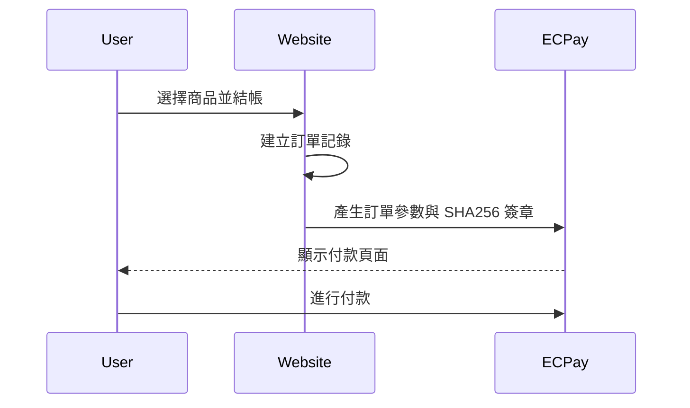

# Payments 功能說明

## 核心模型結構

### Order 模型
```python
class Order(models.Model):
    order_id = models.CharField(max_length=100, unique=True)
    amount = models.IntegerField()
    description = models.CharField(max_length=200)
    created_at = models.DateTimeField(auto_now_add=True)
    paid = models.BooleanField(default=False)
    reward = models.ForeignKey(Reward, on_delete=models.CASCADE, related_name="orders")
    user = models.ForeignKey(User, on_delete=models.CASCADE, related_name="orders")
    quantity = models.PositiveIntegerField(default=1)
```

主要欄位說明：
- `order_id`: 訂單編號（唯一）
- `amount`: 訂單金額
- `description`: 訂單描述
- `paid`: 支付狀態
- `reward`: 關聯的回饋項目
- `user`: 訂購用戶

## 綠界金流整合

### 1. 環境配置
```python
# 必要的環境變數
ECPAY_MERCHANT_ID = "綠界商店代號"
ECPAY_HASH_KEY = "綠界 HashKey"
ECPAY_HASH_IV = "綠界 HashIV"
ECPAY_PAYMENT_URL = "綠界付款 URL"
```

### 2. 安全機制實現

#### SHA256 簽章生成
```python
def _generate_check_mac(self, params):
    # 1. 參數排序
    sorted_params = sorted(params.items())
    
    # 2. 組合參數字串
    param_str = "HashKey=" + self.hash_key
    for key, value in sorted_params:
        param_str += "&" + key + "=" + str(value)
    param_str += "&HashIV=" + self.hash_iv
    
    # 3. URL encode
    encoded_str = urllib.parse.quote_plus(param_str).lower()
    
    # 4. 特殊字符處理
    encoded_str = encoded_str.replace("%2d", "-")
    encoded_str = encoded_str.replace("%5f", "_")
    # ... 其他特殊字符處理
    
    # 5. SHA256 雜湊
    check_mac = hashlib.sha256(encoded_str.encode("utf-8")).hexdigest().upper()
    
    return check_mac
```

### 3. 訂單建立流程
```python
def create_order(self, order_id, amount, description):
    # 1. 準備訂單參數
    order_params = {
        "MerchantID": self.merchant_id,
        "MerchantTradeNo": order_id,
        "MerchantTradeDate": datetime.now().strftime("%Y/%m/%d %H:%M:%S"),
        "PaymentType": "aio",
        "TotalAmount": str(amount),
        "TradeDesc": urllib.parse.quote(description),
        "ItemName": description,
        "ReturnURL": f"{self.base_url}/payments/notify/",
        "ClientBackURL": f"{self.base_url}/payments/complete/",
        "ChoosePayment": "Credit",
        "EncryptType": "1",
    }
    
    # 2. 生成檢查碼
    check_mac = self._generate_check_mac(order_params)
    order_params["CheckMacValue"] = check_mac
    
    return order_params
```

## 金流互動流程

### 1. 訂單建立與付款


### 2. 付款通知處理
```python
@csrf_exempt
def payment_notify(request):
    if request.method == "POST":
        notify_data = request.POST.dict()
        order = Order.objects.get(order_id=notify_data.get("MerchantTradeNo"))
        
        if notify_data.get("RtnCode") == "1":
            order.paid = True
            order.save()
```

### 3. 安全性考量

1. **參數加密**
   - 使用 SHA256 進行參數簽章
   - 確保資料傳輸完整性
   - 防止參數被篡改

2. **交易驗證**
   - 驗證商店代號
   - 檢查訂單金額
   - 確認交易狀態碼

3. **通知機制**
   - 非同步通知（ReturnURL）
   - 同步回傳（ClientBackURL）
   - 交易資料保存

## 自動化處理

### 1. 訂單狀態更新
```python
def save(self, *args, **kwargs):
    with transaction.atomic():
        # 檢查訂單狀態變更
        if self.pk:
            old_order = Order.objects.get(pk=self.pk)
            status_changed = old_order.paid != self.paid
        else:
            status_changed = self.paid
            
        # 更新相關資料
        if status_changed and self.paid:
            # 更新贊助狀態
            Sponsor.objects.filter(
                account=self.user,
                project=project,
                reward=self.reward,
                amount=self.amount,
                status="pending"
            ).update(status="paid")
            
            # 更新專案募資金額
            project.update_raised_amount()
```

### 2. 錯誤處理
```python
try:
    order = Order.objects.get(order_id=notify_data.get("MerchantTradeNo"))
    # 處理訂單
except Order.DoesNotExist:
    return HttpResponse("Order not found", status=404)
```

## 使用流程

1. **建立訂單**
   - 選擇回饋項目
   - 填寫訂單資訊
   - 產生訂單編號

2. **進行付款**
   - 重導向至綠界付款頁面
   - 選擇付款方式
   - 完成付款程序

3. **付款完成**
   - 接收付款通知
   - 更新訂單狀態
   - 處理後續流程 